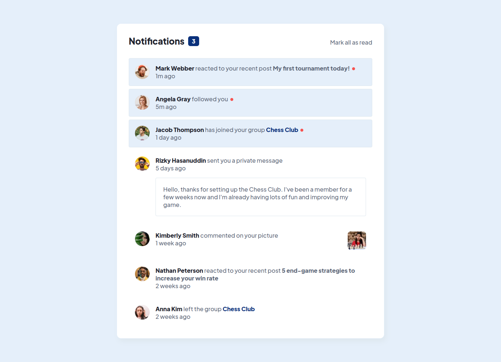

# Frontend Mentor - Notifications page solution

This is a solution to the [Notifications page challenge on Frontend Mentor](https://www.frontendmentor.io/challenges/notifications-page-DqK5QAmKbC). Frontend Mentor challenges help you improve your coding skills by building realistic projects.

## Table of contents

- [Frontend Mentor - Notifications page solution](#frontend-mentor---notifications-page-solution)
  - [Table of contents](#table-of-contents)
  - [Overview](#overview)
    - [The challenge](#the-challenge)
    - [Screenshot](#screenshot)
    - [Links](#links)
  - [My process](#my-process)
    - [Built with](#built-with)
    - [What I learned](#what-i-learned)
    - [Useful resources](#useful-resources)
  - [Author](#author)

## Overview

### The challenge

Users should be able to:

- Distinguish between "unread" and "read" notifications
- Select "Mark all as read" to toggle the visual state of the unread notifications and set the number of unread messages to zero
- View the optimal layout for the interface depending on their device's screen size
- See hover and focus states for all interactive elements on the page

### Screenshot



### Links

- Solution URL: [Solution URL](https://www.frontendmentor.io/solutions/notifications-page-solution-JIrKGirJa1)
- Live Site URL: [Live Site URL](https://alxrdev.github.io/notifications-page/)

## My process

### Built with

- Semantic HTML5 markup
- CSS custom properties
- Flexbox
- Javascript

### What I learned

I learned a new CSS pseudo-class: ":has".

```css
.notifications__item:has(.notifications__message:hover) {
  background-color: var(--white);
  border: 1px solid transparent;
}
```

### Useful resources

- [:has()](https://developer.mozilla.org/en-US/docs/Web/CSS/:has) - This helped me to use the ":has" pseudo-class.

## Author

- Github - [Alex Rodrigues Moreira](https://www.github.com/alxrdev)
- Frontend Mentor - [@alxrdev](https://www.frontendmentor.io/profile/alxrdev)
- Twitter - [@alxrdev](https://www.twitter.com/alxrdev)
